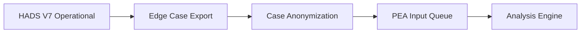
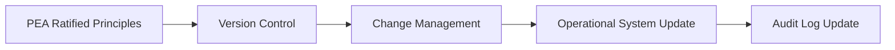

# **White Paper: Constitutional AI Governance Framework**
## **The HADS V7 Architecture & Principle Evolution Agent**

*Document Version: 1.0*
*Classification: Architecture & Governance*
*Date: [Current Date]*

---

## **Executive Summary**

This document proposes a **two-tier architectural framework** for autonomous AI governance systems, separating **operational decision-making** from **constitutional evolution**. The framework enables continuous improvement while maintaining auditability, safety, and human oversight.

## **1. Architectural Overview**

### **1.1 Core System (HADS V7)**
**Purpose**: Real-time constitutional decision-making
**Responsibility**: Apply principles to operational decisions
**Key Characteristic**: **Stable, auditable, fast**

### **1.2 Principle Evolution Agent (PEA)**
**Purpose**: Continuous constitutional improvement
**Responsibility**: Analyze edge cases, propose principle refinements
**Key Characteristic**: **Adaptive, collaborative, deliberate**

## **2. Operational Separation Rationale**

### **2.1 Safety by Design**
```
Operational System → Stable principles → Predictable outcomes
     ↓
Evolution Agent → Analyzes outcomes → Proposes improvements
     ↓
Human Collaboration → Ratifies changes → Updates operational system
```

### **2.2 Performance Isolation**
- **Operational System**: Sub-100ms decision latency required
- **Evolution Agent**: Batch processing, no real-time constraints
- **Separation prevents learning overhead from impacting performance**

### **2.3 Audit Trail Preservation**
- Operational decisions remain tied to specific principle versions
- Principle changes occur through explicit version updates
- Complete lineage from edge case to constitutional amendment

## **3. Principle Evolution Agent Specification**

### **3.1 Data Interface**
```yaml
Input Sources:
  - Edge case decisions requiring AI interpretation
  - Human feedback and override logs
  - Performance metrics and anomaly detection
  - External regulatory updates

Output Channels:
  - Principle amendment proposals
  - Precedent documentation
  - Collaboration requests
  - Constitutional version updates
```

### **3.2 Core Components**

#### **3.2.1 Case Analysis Engine**
- Identifies patterns in edge cases
- Extracts reasoning patterns from wise judgments
- Calculates novelty scores for potential learning

#### **3.2.2 Principle Proposal Generator**
- Formulates precise constitutional language
- Maps cases to existing principle applications
- Identifies gaps requiring new principles

#### **3.2.3 Collaborative Governance Interface**
- Manages human review workflows
- Tracks ratification progress
- Documents deliberation and rationale

### **3.3 Operation Modes**

#### **Mode A: Continuous Learning**
```yaml
Frequency: Daily batch processing
Scope: All edge cases from previous 24 hours
Output: Principle application precedents
Autonomy: High (documentation only)
```

#### **Mode B: Constitutional Convention**
```yaml
Frequency: Weekly/Monthly
Scope: Accumulated insights and proposals
Output: Ratified principle amendments
Autonomy: Low (requires human collaboration)
```

## **4. Data Flow & Integration**

### **4.1 From Operational System to PEA**


**Data Elements**:
- Decision context and facts
- AI reasoning transcripts
- Principle violations detected
- Final judgment and outcome

### **4.2 From PEA to Operational System**


**Update Protocol**:
- Versioned principle bundles
- Rollback capabilities
- A/B testing for significant changes
- Gradual rollout strategies

## **5. Governance Model**

### **5.1 Collaboration Framework**
```
Tier 1: Automated Precedent Recognition
    - AI identifies new applications of existing principles
    - Auto-documents for audit purposes
    - No operational system changes

Tier 2: Human-in-the-Loop Evolution
    - AI proposes principle refinements
    - Human collaborators review and ratify
    - Scheduled update cycles

Tier 3: Constitutional Conventions
    - Major principle additions/modifications
    - Multi-stakeholder deliberation
    - Formal version releases
```

### **5.2 Role Definitions**

#### **Constitutional Stewards**
- Legal and compliance experts
- Principle ratification authority
- Change impact assessment

#### **Domain Specialists**
- Provide context for edge cases
- Validate proposed principle applications
- Suggest refinement parameters

#### **System Operators**
- Implement ratified changes
- Monitor system performance
- Manage version deployments

## **6. Implementation Roadmap**

### **Phase 1: Foundation** (Months 1-2)
- Deploy HADS V7 operational system
- Implement basic PEA data collection
- Establish collaboration interfaces

### **Phase 2: Evolution** (Months 3-6)
- Activate precedent recognition
- Deploy principle proposal generation
- Onboard initial human collaborators

### **Phase 3: Maturity** (Months 7-12)
- Full collaborative governance
- Automated update pipelines
- Performance impact monitoring

## **7. Risk Mitigation**

### **7.1 Principle Drift Prevention**
- Version-controlled principle changes
- Rollback capabilities for all updates
- Impact simulation before deployment
- Human ratification for all modifications

### **7.2 Performance Protection**
- Operational system isolated from learning overhead
- Batch processing for evolution tasks
- Resource quotas for PEA activities
- Performance regression testing

### **7.3 Auditability Assurance**
- Complete decision lineage preservation
- Principle version tracking per decision
- Change justification documentation
- Regular compliance reviews

## **8. Success Metrics**

### **Operational Excellence**
- Decision latency < 100ms
- 99.9% system availability
- Zero unapproved principle changes

### **Evolution Effectiveness**
- Edge case resolution time reduction
- Human override rate decrease
- Principle coverage improvement
- Collaboration engagement metrics

### **Safety & Compliance**
- Audit trail completeness
- Regulatory requirement coverage
- Principle violation prevention
- Human satisfaction scores

## **9. Conclusion**

The **two-tier constitutional AI architecture** represents a paradigm shift in autonomous system design. By separating operational decision-making from continuous improvement, we achieve both **stability and adaptability** - the essential ingredients for trustworthy AI governance.

The **Principle Evolution Agent** operationalizes the vision of "through the haze we see infinity" - transforming complex edge cases into refined wisdom while maintaining the safety and auditability required for enterprise deployment.

---

## **Appendices**

### **Appendix A: Data Schema Specifications**
Edge case export format, principle amendment structure, collaboration workflow definitions.

### **Appendix B: Integration Protocols**
REST API specifications, event schema, version control methodology.

### **Appendix C: Governance Procedures**
Collaboration workflows, ratification processes, emergency override protocols.

### **Appendix D: Compliance Framework**
Regulatory mapping, audit requirements, reporting standards.

---

*This framework enables organizations to deploy AI systems that not only follow rules but develop wisdom through experience, while maintaining the control and oversight necessary for high-stakes environments.*

**Contact**: [Your contact information]
**Reference Implementation**: HADS V7 Constitutional Architecture
